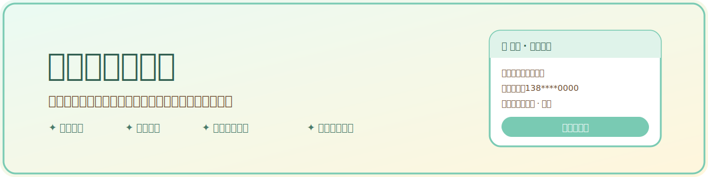
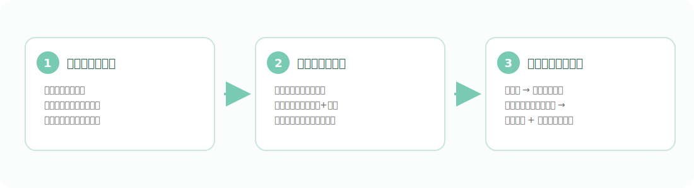
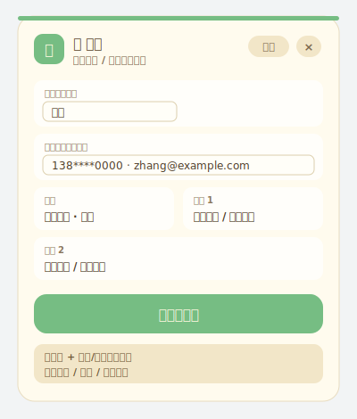
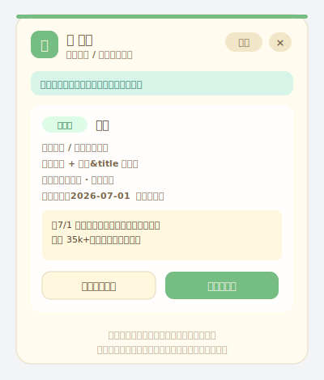
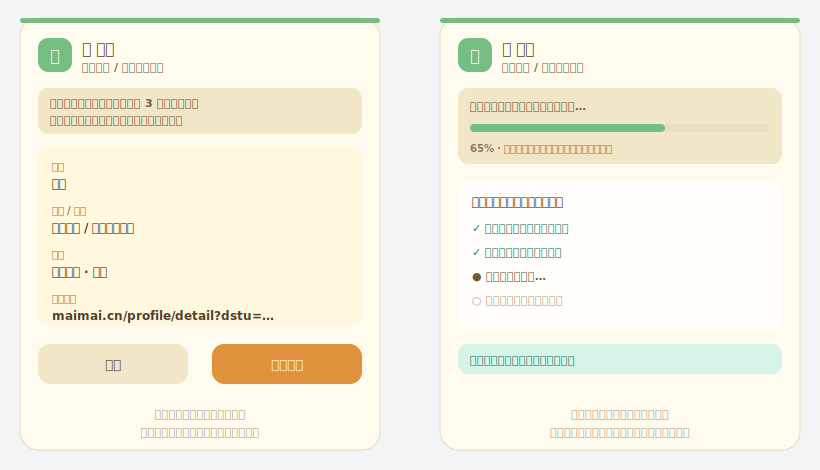
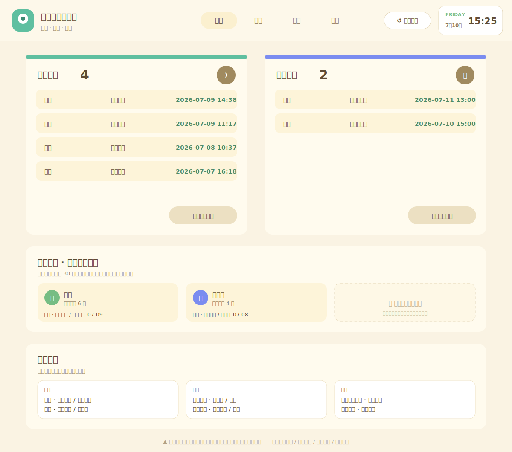

<p align="center">
  
</p>

<p align="center">
  
  
  
  
</p>

# 更好的谷露前端

**一句话：你在脉脉看人，插件帮你先看一眼谷露里有没有这个人——有就别重复跟进，没有就一键建档、简历自动补全。**

招聘顾问每天的日常：在脉脉刷到一个不错的候选人，切回谷露 CRM 搜名字、搜公司、翻记录，确认是不是已经有人跟进过……一个人要重复几十次。这个插件把这套动作压缩成一次点击。

## 它是怎么工作的

<p align="center">
  
</p>

> 本仓库所有插图均为示意图（虚构数据），不含任何真实候选人信息。

## 核心功能

### 🔍 脉脉查重浮窗

打开脉脉人才详情页，浮窗自动抓取姓名、公司、学历、联系方式，一键比对谷露在库记录：

<p align="center">
  
  
</p>

- **联系方式精确匹配**优先（手机 / 邮箱），其次档案链接，再按「姓名 + 经历/学校」分级比对，结果标注**强命中 / 疑似 / 同名**；
- 命中卡直接展示在库记录的顾问、最近更新和备注正文——是否撞候选人一眼看清；
- 纯重名、公司职位全对不上的记录自动丢弃，不给你添噪音;
- 抓取不准时姓名、联系方式都可以手动改。

### 📄 一键建档 + 简历自动补全

查无在库？点一下就在谷露建档，并自动拉取简历解析回填——不用再手动下载、上传、逐字段粘贴。

<p align="center">
  
</p>

- **落库前确认**：要写入的字段先预览，确认后才创建，不产生脏数据；
- **附件简历优先**：候选人有近两年上传的附件简历就优先用它（信息更全），图片版解析不出时自动改用在线简历；
- **只补不覆盖**：原有附件、经历描述、联系方式一律保留，只补库里没有的内容；
- 全程进度条，每一步看得见。

### 📊 谷露页面只读增强

谷露页面内提供更清爽的「岛屿工作台」只读视图：本周简历推荐、客户面试、最近人才/公司/项目一屏看完，随时一键「恢复谷露」回原页面。新增、编辑、推荐等写操作仍回谷露原页面完成。

<p align="center">
  
</p>

### 🔄 团队自动更新（内部部署可选）

管理员发一次安装包，成员机器每天自动静默更新到最新版，还能统计谁装到了哪个版本。公开版默认关闭此功能。

## 快速上手（普通顾问）

向管理员要打包好的插件文件夹 `dist-extension`（或解压收到的压缩包），然后：

1. 浏览器地址栏输入 `edge://extensions/`（Chrome 是 `chrome://extensions/`）；
2. 打开「开发人员模式」；
3. 点「加载解压缩的扩展」，选择 `dist-extension` 文件夹；
4. 右上角出现插件图标即安装完成。

使用前先登录你们公司的谷露 CRM——插件不保存账号密码，只能读取你当前账号本来就有权限看到的数据。之后打开脉脉候选人页面，浮窗会自动出现。

## 部署（管理员 / 技术同事）

```bash
git clone https://github.com/William-0406/better-gllue-frontend.git
cd better-gllue-frontend
cp .env.example .env.local   # 填入你们自己的谷露地址
npm install
npm run build:extension      # 产物在 dist-extension/
```

`.env.local` 关键配置（该文件已被 .gitignore 排除，不会提交）：

| 变量 | 说明 |
| --- | --- |
| `VITE_GLLUE_HOST` | 谷露 CRM 主机名（不带 http://），必填 |
| `VITE_ENHANCE_HOST` | 可选增强服务（更深查重 + OCR），没有就留空 |
| `VITE_REPORT_GITEE_*` | 可选安装统计（往自己的 Gitee 私库签到），公开使用请留空 |

## 边界与提醒

- 插件提示只是**辅助判断**，不是最终结论——同名多、写法不一致时仍可能漏判/误判，请人工确认；
- 脉脉或谷露页面改版后，抓取可能需要适配更新；
- 请勿把候选人截图、内部地址、日志发到公开场合。

## 隐私说明

- 设计为只读辅助工具，写操作回谷露原页面完成；
- 本公开仓库不含内网地址、账号密码、token 或任何真实候选人数据；
- 本地配置、构建产物、内部文档均已通过 `.gitignore` 排除。

## 技术栈

React + TypeScript + Vite，Chrome / Edge Manifest V3 扩展（content script + service worker），无任何第三方数据上传。

## 许可证

暂未声明开源许可证，请按 source-available 项目理解和使用。
